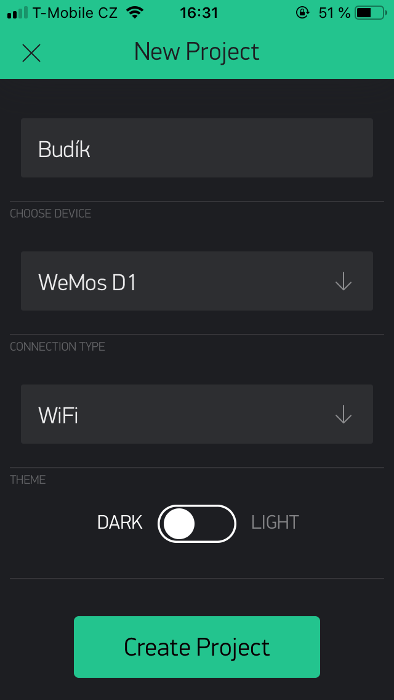

# Nastavení

## Aplikace Blynk

* Stáhněte a nainstalujte si aplikaci Blynk (https://blynk.io/en/getting-started)
* Vytvořte si v aplikaci Blynk nový účet/přihlašte se pokud už účet máte
* Vytvořte v aplikaci nový projekt (New project), device je `Wemos D1 mini`, connection type je `WiFi`
* Blynk odešle na mail zadaný při registraci **Auth token**, ten si zkopírujte nebo opište, budeme jej potřebovat v dalším kroku

## Připojení hodin k WiFi

Na displeji hodin musí svítit **AP** a je potřeba mít Blynk **Auth token**. Připojte se na WiFi `alarm-clock-xxxxxx` (xxxxxx je číslo hodin, může se měnit).

Objeví se nastavovací obrazovka (to může chvíli trvat, na některých Android telefonech je potřeba ji ručně otevřít). Pokud se obrazovka neobjeví, zadejte do prohlížeče adresu http://192.168.4.1/, poté zvolte možnost Configure WiFi a počkejte, dokud se neobjeví výběr WiFi sítí.

Vyberte vaši WiFi síť a do prostředního políčka napište její heslo. Do posledního políčka vložte Auth token a stiskněte tlačítko `Save`

Po připojení k WiFi na hodinách svítí nuly.

## Nastavení projektu Blynk

Otevřete aplikaci Blynk a zvolte projekt budíku. Obrazovka by měla vypadat podobně.

V aplikaci Blynk otevřete projekt a přidejte první kompnentu (na Androidu klepnutím na plus v kolečku, na iOS swipem doleva).

První komponenta, kterou přidáme je **Real-time Clock**. Klepněte na ikonu Play v pravém horním rohu a restartujte hodiny (stiskem tlačítka reset nebo odpojením a připojením kabelu). Pokud vše proběhlo v pořádku, na displeji je aktuální čas.

Klepněte na ikonu Stop a přidejte další komponenty: **Time Input**, .**Button** a **Notification**. Klepnutím na každou komponentu Time Input otevřete její nastavení a nastavte ji podle následujícího obrázku:

Další komponenta, kterou nastavíme je Button:

Další komponenta je Notification:

